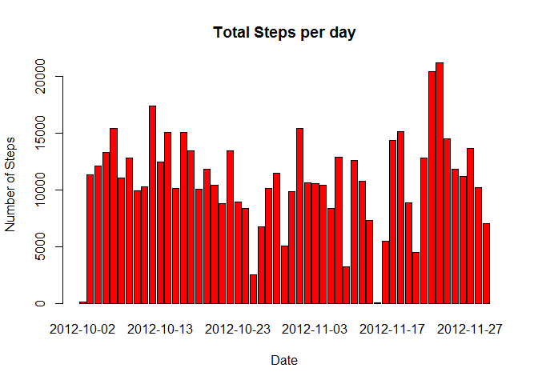
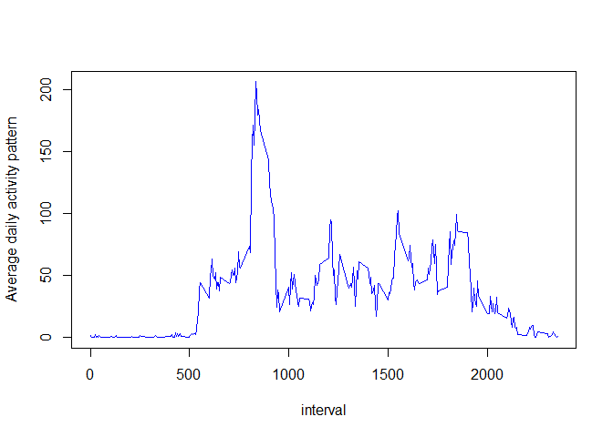
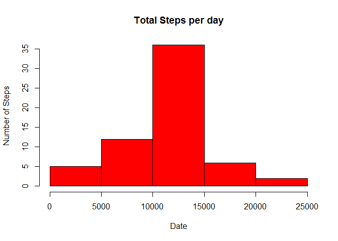

# Reproducible Research: Peer Assessment 1


## Loading and preprocessing the data


```r
data <- read.csv("activity.csv")
```


```r
data$date <- as.Date(data$date, "%Y-%m-%d")
```
## What is mean total number of steps taken per day?

```r
data2 <- subset(na.omit(object = data))
data3 <- aggregate(data2$steps, data2[2], sum)
barplot(data3$x, names.arg = data3$date, col ="red", main  = "Total Steps per day", xlab = "Date", ylab = "Number of Steps")
```

<!-- -->

*The mean number of steps per day*

```r
mean(data3$x)
```

```
## [1] 10766.19
```
*The median steps per day*

```r
median(data3$x)
```

```
## [1] 10765
```

## What is the average daily activity pattern?

```r
data4 <- aggregate(data$steps, data[3], mean, na.rm =TRUE)
plot(x ~ interval, data = data4, type = "l", xlab = "interval", ylab = "Average daily activity pattern", col = "blue")
```

<!-- -->

```r
data4[c(which(data4$x == max(data4$x)),which(data4$x == max(data4$x))+1),1]
```

```
## [1] 835 840
```
## Imputing missing values
*getting the number of missing values*

```r
nrow(data[is.na(data$steps),])
```

```
## [1] 2304
```
*imputing values*

```r
library(dplyr)
cleaned <- merge(data,data4,by="interval", na.rm= TRUE)
cleaned[which(is.na(cleaned$steps)),]$steps <- cleaned[which(is.na(cleaned$steps)),]$x
cleaned <- select(cleaned, -x)
```
*Creating a histogram of the steps taken per day with imputed values*

```r
histdata <- aggregate(cleaned$steps, cleaned[3], sum, na.rm =TRUE)
hist(histdata$x, col = "red", main = "Total Steps per day", xlab = "Date",  ylab = "Number of Steps")
```

<!-- -->

```r
mean(histdata$x)
```

```
## [1] 10766.19
```

```r
median(histdata$x)
```

```
## [1] 10766.19
```
*note that the mean and median are now the same. This is because of the imputed values.*

## Are there differences in activity patterns between weekdays and weekends?

```r
library(chron)
cleaned$flag<-as.factor(ifelse(is.weekend(cleaned$date), "weekend", "weekday"))
```


```r
plotdata <- aggregate(cleaned$steps, cleaned[c(1,4)], mean)
```

*Create the panel plot*

```r
library(lattice)
xyplot(x ~ interval | flag,data=plotdata,layout=c(1,2),type="l",xlab="Interval",ylab="Number of steps")
```

<!-- -->
*End of document*
